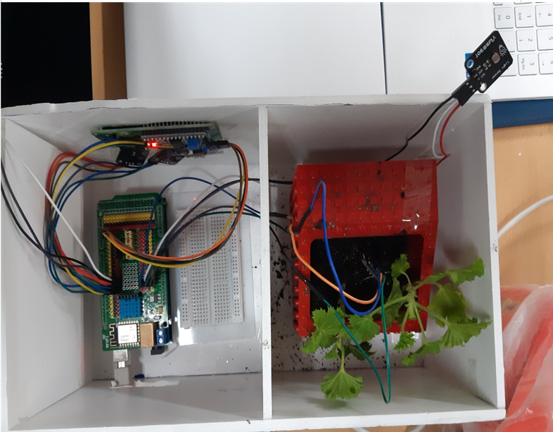

# PlantGrowthConditionSystem
### 아두이노 모듈을 활용한 미니 식물 성장 조건 감지 시스템

## 프로젝트 요약
> 2인 팀 프로젝트
> 2021.11.16 - 2021.12.7   
 
> **자라나라 나무나무 조 프로젝트(2인)**
* 시스템 구현1, 프로젝트 문서 및 피드백 작성1으로 구성되어 있습니다.
* 식물의 성장 조건에 맞춰 부족한 요소(수분, 햇빛, 온도, 습도)가 무엇인지 육안으로 확인할 수 있게 하기 위하여 개발
* 사용한 모듈은 많지 않으나 아이디어 면에서 참신하다고 느낀 교수님들의 종합적인 의견으로 학술제 동상 
 

## 프로젝트 로직

## 담당 역할
### 식물성장조건감지시스템 구현
 
* 버튼 모듈을 이용하여 누른 상태에서는 성장감지시스템 작동 뗀 상태에서는 시스템 종료 구현
* 조도센서와 토양수분감지센서를 통해 빛의 양, 수분의 양 체크하도록 구현
* dht11 센서(온습도 센서)를 통해 온,습도 정도를 시리얼 모니터로 출력할 수 있도록 구현
* 식물의 현재 성장 상태를 3색 LED 불빛, LCD 문자 출력을 통해 감지 

## 결과 영상
https://www.youtube.com/shorts/B0A2qWe1KWA
